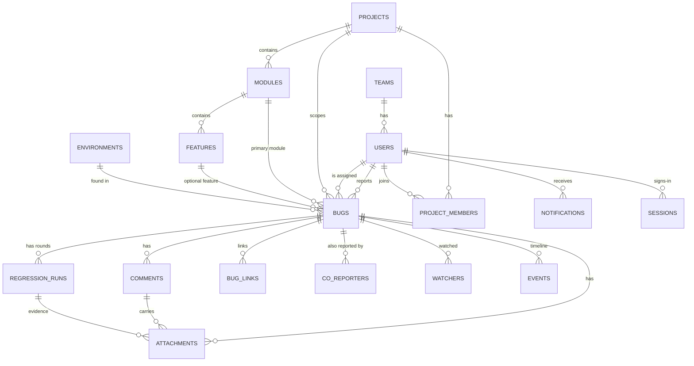

# Data model

The schema is declared once in `src/server/db/schema.ts`. From that declaration Bugloop
generates the SQLite DDL (server) and the in-memory tables (browser demo and tests), so both
runtimes share the same tables, columns, types and indexes.

Conventions:

* IDs are prefixed random strings (`usr_…`, `bug_…`). The human bug key (`BUG-000124`) comes
  from a monotonic sequence and is never reused.
* Timestamps are ISO-8601 UTC strings.
* `json` columns are stored as TEXT in SQLite and as native values in memory.
* Nothing is hard-deleted from `bugs`, `comments`, `attachments` or `events`.

## Entity relationships

## Tables

### Organisation

| Table | Key columns |
|---|---|
| `users` | `id`, `name`, `email` (unique), `password_hash`, `role`, `team_id`, `title`, `avatar_color`, `active`, `notification_prefs` (json), `created_at`, `updated_at`, `last_seen_at`, `deactivated_at` |
| `teams` | `id`, `name`, `kind` (qa / engineering / product), `lead_id`, `description`, `created_at` |
| `projects` | `id`, `key`, `name`, `description`, `qa_lead_id`, `pm_id`, `archived`, `created_at`, `updated_at` |
| `project_members` | `id`, `project_id`, `user_id`, `joined_at`, `left_at` |
| `modules` | `id`, `project_id`, `name`, `description`, `owner_id` (default assignee), `sort_order`, `archived`, `created_at` |
| `features` | `id`, `module_id`, `name`, `description`, `sort_order`, `archived`, `created_at` |

### Configuration

| Table | Key columns |
|---|---|
| `environments` | `id`, `name`, `kind` (development / qa / staging / production / other), `description`, `sort_order`, `active` |
| `severity_levels` | `key`, `label`, `description`, `color`, `rank`, `active` |
| `priority_levels` | `key`, `label`, `description`, `color`, `rank`, `active` |
| `status_config` | `key` (system status), `label`, `description`, `color`, `sort_order`, `enabled`, `attention_hours` |
| `settings` | `key`, `value` (json), `updated_at`, `updated_by_id` |
| `sequences` | `name`, `value` |

### Bugs

`bugs` holds the current state plus explicit ownership and credit fields, so the questions
"who reported, who fixed, who verified" never require replaying history.

| Group | Columns |
|---|---|
| Identity | `id`, `number`, `key`, `project_id`, `module_id`, `feature_id`, `affected_module_ids` (json) |
| Report | `title`, `description`, `steps` (json string[]), `expected_result`, `actual_result`, `environment_id`, `browser`, `device`, `os`, `app_version`, `page_url`, `frequency`, `severity`, `priority`, `tags` (json), `notes` |
| State | `status`, `status_changed_at`, `info_return_status`, `info_requested_from_id`, `info_requested_by_id`, `disputed`, `dispute_context` (json), `dispute_locked`, `reopen_count`, `regression_round` |
| People and credit | `reporter_id`, `assignee_id`, `collaborator_ids` (json), `reviewed_by_id`, `reviewed_at`, `confirmed_by_id`, `confirmed_at`, `first_response_at`, `fixed_by_id`, `fixed_at`, `verified_by_id`, `verified_at`, `closed_by_id`, `closed_at` |
| Resolution | `fix_version`, `resolution_summary`, `root_cause`, `resolution_reason`, `rejection_category`, `duplicate_of_id`, `deferred_until`, `deferred_target`, `decision_by_id`, `decision_at`, `decision_acknowledged_at`, `close_reason` |
| Location | `page_id` (screen from the product map), `location` (json: element, report attachment, box as fractions, source) |
| Assistant and duplicates | `ai_assisted`, `ai_meta` (json: provider, fields drafted, provenance, inferred fields the reporter confirmed, edited-after-draft, screenshot observations), `duplicate_check` (json: candidates shown and the reporter's decision), `potential_duplicate_ids` (json) |
| Lifecycle | `archived_at`, `archived_by_id`, `archive_reason`, `created_at`, `updated_at`, `last_activity_at` |

Related tables:

| Table | Purpose / key columns |
|---|---|
| `comments` | `id`, `bug_id`, `author_id`, `kind` (comment / question / answer / dispute / decision / regression), `body`, `mentions` (json), `created_at`, `edited_at` |
| `attachments` | `id`, `bug_id`, `comment_id`, `regression_run_id`, `uploader_id`, `filename`, `mime_type`, `size_bytes`, `storage_key`, `context` (report / info / regression / comment), `created_at` |
| `regression_runs` | `id`, `bug_id`, `round`, `assignee_id`, `requested_by_id`, `requested_at`, `environment_id`, `build`, `started_at`, `completed_at`, `completed_by_id`, `result` (pending / passed / failed / cancelled), `notes` |
| `bug_links` | `id`, `bug_id`, `target_bug_id`, `kind` (duplicate_of / related), `created_by_id`, `created_at` |
| `co_reporters` | `id`, `bug_id`, `user_id`, `via_bug_id`, `note`, `created_at`: credit for people who reported the same problem |
| `watchers` | `id`, `bug_id`, `user_id`, `created_at` |

### Activity, audit and notifications

| Table | Purpose / key columns |
|---|---|
| `events` | Append-only log that drives both the bug timeline and the audit log: `id`, `bug_id` (nullable), `actor_id` (null = system), `type`, `entity_type`, `entity_id`, `data` (json: before/after values, reasons, links), `created_at` |
| `notifications` | `id`, `user_id`, `type`, `category` (action / decision / progress / discussion), `bug_id`, `actor_id`, `title`, `body`, `created_at`, `read_at` |
| `sessions` | `id`, `token_hash`, `user_id`, `created_at`, `expires_at`, `last_used_at` |
| `ai_requests` | Usage log for transparency: `id`, `user_id`, `feature`, `provider`, `model`, `status`, `duration_ms`, `input_tokens`, `output_tokens`, `error`, `created_at` |

### Event types

`bug.created`, `bug.updated` (field diffs), `bug.status_changed`, `bug.assigned`,
`bug.collaborators_changed`, `bug.severity_changed`, `bug.priority_changed`,
`bug.info_requested`, `bug.info_provided`, `bug.duplicate_linked`, `bug.link_added`,
`bug.co_reporter_added`, `bug.disputed`, `bug.decision_upheld`, `bug.decision_accepted`,
`bug.reopened`, `bug.closed`, `bug.archived`, `bug.restored`, `comment.added`,
`attachment.added`, `regression.requested`, `regression.started`, `regression.passed`,
`regression.failed`, `regression.reassigned`, plus admin events (`project.*`, `module.*`,
`feature.*`, `user.*`, `team.*`, `config.*`, `settings.updated`) and `auth.login`.

## Indexes

`bugs(status)`, `bugs(project_id, status)`, `bugs(assignee_id, status)`, `bugs(reporter_id)`,
`bugs(module_id)`, `bugs(updated_at)`, `events(bug_id, created_at)`, `events(created_at)`,
`notifications(user_id, created_at)`, `comments(bug_id)`, `attachments(bug_id)`,
`regression_runs(bug_id)`, `regression_runs(assignee_id, result)`, `watchers(bug_id)`,
`watchers(user_id)`, `co_reporters(bug_id)`, `bug_links(bug_id)`, `sessions(token_hash)`.

## Product map

`pages`: one screen of a project. `project_id`, `module_id`, `feature_id` (optional), `name`,
`path`, `description`, `elements` (json list), `rules` (json list), `keywords` (json list),
`importance` (critical · high · normal · low), `archived`, timestamps. Maintained by QA leads,
project managers and admins; bulk import upserts by name within a module and never deletes.
SQLite databases from earlier versions gain new columns automatically at start-up.
