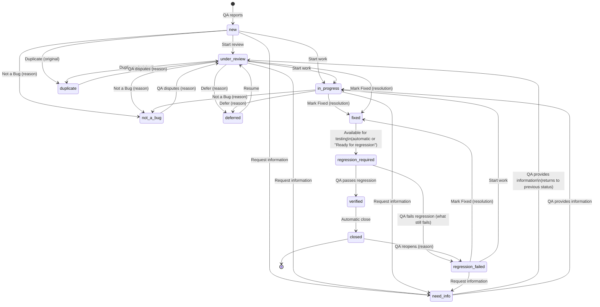

# Bug lifecycle

The lifecycle is enforced by a single workflow engine (`src/core/workflow.ts`). The API
never accepts a raw status. It accepts **actions**, checks role and context, validates the
required inputs, applies automatic follow-up transitions, and writes events and
notifications. The UI renders exactly the actions the engine returns for the signed-in user,
so the buttons and the rules can never disagree.

## Statuses

| Key | Label | Phase | Waiting on |
|---|---|---|---|
| `new` | New | Triage | Engineering (assignee or triage) |
| `under_review` | Under Review | Triage | Engineering |
| `in_progress` | In Progress | Engineering | Engineering (assignee) |
| `need_info` | Need More Information | Waiting on QA | The person the question was addressed to (default: reporter) |
| `not_a_bug` | Not a Bug | Resolved | Nobody. Reporter can dispute. |
| `duplicate` | Duplicate | Resolved | Nobody. Linked to the root original. Reporter can dispute. |
| `deferred` | Deferred | Parked | Nobody until revisited (reason and optional revisit date recorded) |
| `fixed` | Fixed | Engineering | Engineering, to make the fix available for testing |
| `regression_required` | Regression Required | Waiting on QA | Regression owner (default: reporter) |
| `regression_failed` | Regression Failed (Reopened) | Engineering | Engineering (assignee) |
| `verified` | Verified | Done | Automatic close, or a QA lead when auto-close is off |
| `closed` | Closed | Done | Nobody |

Labels, colours, descriptions and *attention thresholds* (hours before a waiting bug is
highlighted as overdue) are configurable in **Admin → Workflow & fields**. *Under Review* and
*Deferred* can be disabled; the related actions then disappear.

## State diagram

(For readability the diagram omits a few edges listed in the table below, such as
*Request information* from `need_info`-eligible states and *Force close*.)

## Actions

"Engineering" means the `engineer` role; *lead* is `qa_lead`; *PM* is `project_manager`.
Admins can perform every action except verifying their own fix.

| Action | Who | From | To | Required input | Side effects |
|---|---|---|---|---|---|
| **Report** | anyone | — | `new` | project, module, title, steps, expected, actual, severity | Auto-assign to module owner; similarity scan; reporter watches |
| **Start review** | engineer, PM | `new` | `under_review` | — | Sets *reviewed by* |
| **Confirm bug** | engineer | `new`, `under_review` | `under_review` | — | Marks the report valid (*confirmed by*) without starting work |
| **Start work** | engineer | `new`, `under_review`, `regression_failed` | `in_progress` | — | Assigns to actor if unassigned; confirms; on a disputed bug, overturns the decision |
| **Request information** | engineer, lead, PM | `new`, `under_review`, `in_progress`, `regression_failed` | `need_info` | question; addressed to (default reporter) | Remembers the status to return to |
| **Provide information** | person asked, reporter, QA lead | `need_info` | previous status | answer (+ optional evidence) | Notifies the asker and assignee |
| **Not a Bug** | engineer, lead | `new`, `under_review`, `in_progress`, `need_info`, `regression_failed` | `not_a_bug` | reason (+ optional category) | Reporter gets a *review decision* item |
| **Duplicate** | engineer, lead, PM | `new`, `under_review`, `in_progress`, `need_info` | `duplicate` | original bug | Resolves to root original; reporter becomes co-reporter of the original; watchers carried over |
| **Defer** | engineer, PM | `new`, `under_review`, `in_progress`, `need_info`, `regression_failed` | `deferred` | reason (+ optional revisit date / target release) | Reporter notified |
| **Resume** | engineer, PM, lead | `deferred` | `under_review` | — | — |
| **Mark Fixed** | engineer | `under_review`, `in_progress`, `regression_failed` | `fixed` → `regression_required` | resolution summary; *available for testing now?* | Records *fixed by*, fix build, collaborators; creates regression round *n* for the regression owner |
| **Ready for regression** | engineer | `fixed` | `regression_required` | — (+ optional build/environment) | Creates the regression round |
| **Start regression** | regression owner, lead | `regression_required` | (no change) | — | Records *regression started* |
| **Pass regression** | regression owner, lead (never the fixer) | `regression_required` | `verified` → `closed` | — (+ optional notes, build tested, evidence) | Records *verified by*; notifies fixer; notifies reporters of duplicates |
| **Fail regression** | regression owner, lead (never the fixer) | `regression_required` | `regression_failed` | what still fails (+ evidence) | Reopen count +1; escalates to lead and PM from the 2nd reopen |
| **Reopen** | QA analyst, lead | `verified`, `closed` | `regression_failed` | reason | Reopen count +1 |
| **Dispute decision** | reporter, lead | `not_a_bug`, `duplicate` | `under_review` | reason | Flags *disputed*; notifies decider and QA lead |
| **Uphold decision** | lead, PM | disputed `under_review` | previous resolution | note | Final: cannot be disputed again |
| **Accept decision** | reporter | `not_a_bug`, `duplicate`, `deferred` | (no change) | — | Clears the reporter's *review decision* item |
| **Close** | lead, regression owner | `verified` (when auto-close is off) | `closed` | — | — |
| **Force close** | lead | any open status | `closed` | reason | Logged as an override |
| **Archive** | lead; reporter while `new` and unassigned | any | (hidden) | reason | Soft delete; ID never reused |
| **Restore** | lead | archived | (visible) | — | — |

Non-status updates are also audited: **assign / reassign** (engineer, lead, PM),
**collaborators**, **reassign regression** (lead), **edit report fields**, **severity**
(reason required when changed by engineering/PM or after resolution; reporter notified),
**priority**, **comment** (with @mentions), **attach evidence**, **link related bugs**,
**"I'm seeing this too"** (adds a co-reporter with optional evidence), **watch / unwatch**.

## Automatic transitions

| Trigger | System action |
|---|---|
| Report submitted in a module with a default owner | Assign to the owner and notify them |
| Fixed with *available for testing* | `fixed` → `regression_required`, create regression round, notify owner |
| Regression passed and auto-close on | `verified` → `closed` (actor: system) |
| Duplicate linked to a duplicate | Link redirected to the root original |
| New report strongly similar to an open bug | *Potential duplicate* flag for triage (never auto-resolved) |

## Regression owner

1. The reporter, if active and in a QA role.
2. Otherwise the project's QA lead.
3. Otherwise any active QA lead.
4. Otherwise the round is unassigned and appears in the QA lead's queue.

A QA lead can reassign a round at any time. Discovery credit stays with the reporter.
