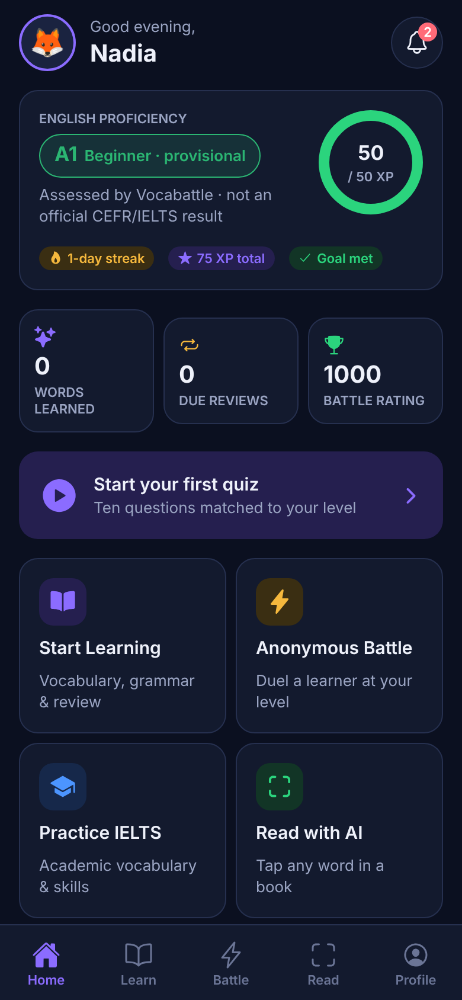
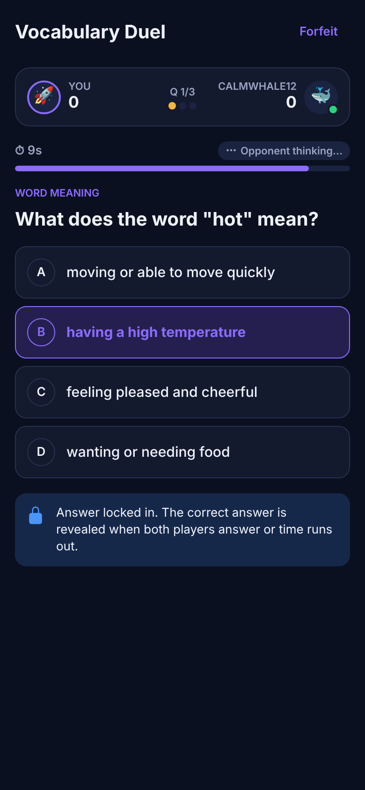
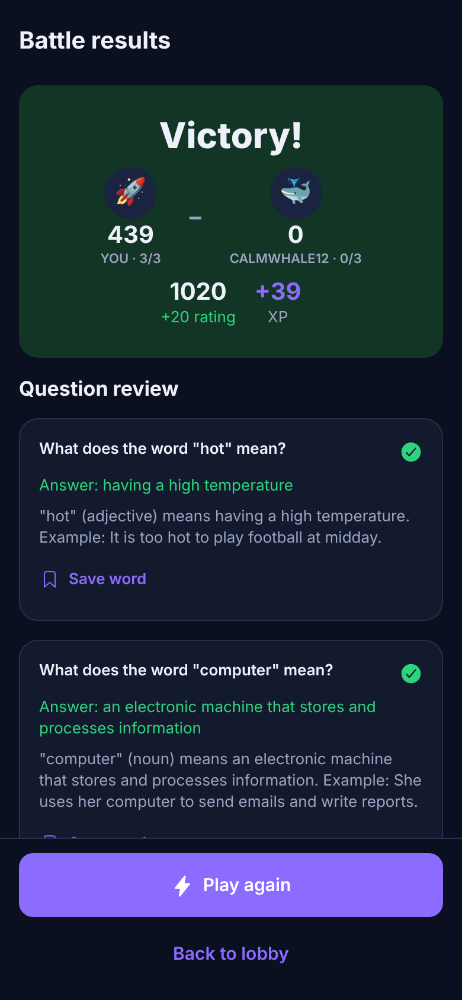
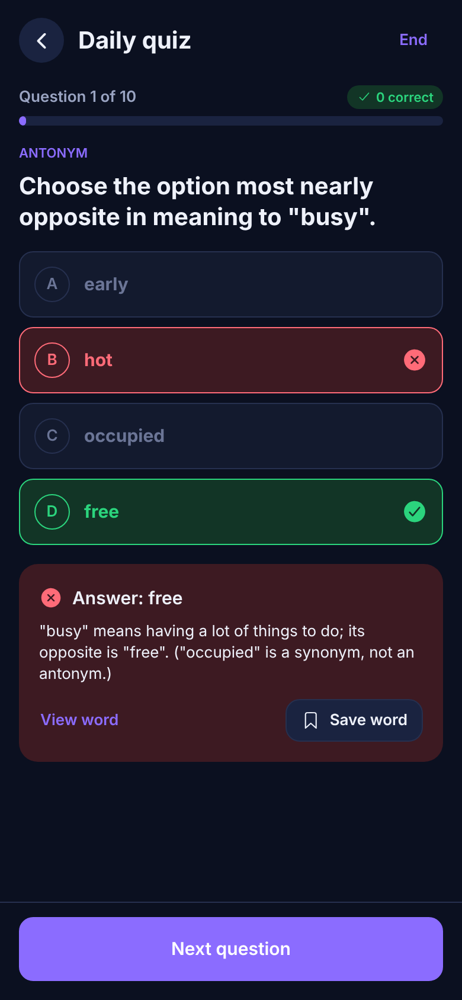

# Vocabattle

AI-powered English learning, anonymous real-time battles and IELTS
preparation — a React Native (Expo) app on a Supabase backend.

> **Status: Phase 1 (functional MVP) complete.** Authentication, onboarding,
> adaptive proficiency assessment, dashboard, vocabulary & grammar quizzes,
> spaced repetition, four anonymous battle modes with ratings and
> leaderboards, profile/settings/privacy, and admin foundations all work on
> real persistent data. The AI reading assistant (Phase 2) and four-skill
> IELTS practice (Phase 3) are designed and clearly labelled in the app as
> upcoming. See [`docs/PHASE1_REPORT.md`](docs/PHASE1_REPORT.md).

| Home | Battle | Results | Quiz feedback |
|---|---|---|---|
|  |  |  |  |

## What makes it different

- **Your level is assessed, never chosen.** A 15-question adaptive test
  places you on a provisional A1–C2 app scale (not an official IELTS/CEFR
  result). Users cannot edit it — the database won't let them.
- **Fair, anonymous battles.** Matchmaking by level and rating, pseudonyms
  like *SilentOwl42*, and every score, timer and rating computed on the
  server. Disconnects, draws, forfeits and server failures all have defined,
  tested outcomes.
- **Learning over grinding.** XP rewards new, correct answers; repeated
  easy wins earn little; battle and review XP are capped daily.
- **Freemium done server-side.** Quotas live in one config table and are
  enforced in the database, not just hidden in the UI.

## Repository

```
mobile/     Expo SDK 57 app (TypeScript, expo-router, TanStack Query)
supabase/   SQL migrations (schema, RLS, RPCs, content) + CLI config
content/    original vocabulary and question sources → scripts/generate-content.mjs
tests/      46 DB integration tests, Playwright E2E journeys, dev-only gateway
docs/       ARCHITECTURE.md · SETUP.md · PHASE1_REPORT.md · screenshots/
```

## Quick start

```bash
# 1. Database
npx supabase link --project-ref <ref> && npx supabase db push
# 2. App
cd mobile && npm install && cp .env.example .env   # set EXPO_PUBLIC_SUPABASE_URL / _ANON_KEY
npm start
```

Full instructions, every environment variable and the list of external
services: [`docs/SETUP.md`](docs/SETUP.md). Design and security model:
[`docs/ARCHITECTURE.md`](docs/ARCHITECTURE.md).

## Tests

```bash
cd tests && npm install
npm test            # 46 integration tests against real PostgreSQL (RLS, assessment, quizzes, battles, concurrency, admin)
./e2e/run.sh        # browser journeys: onboarding → assessment → quiz; two accounts playing a live battle
```
